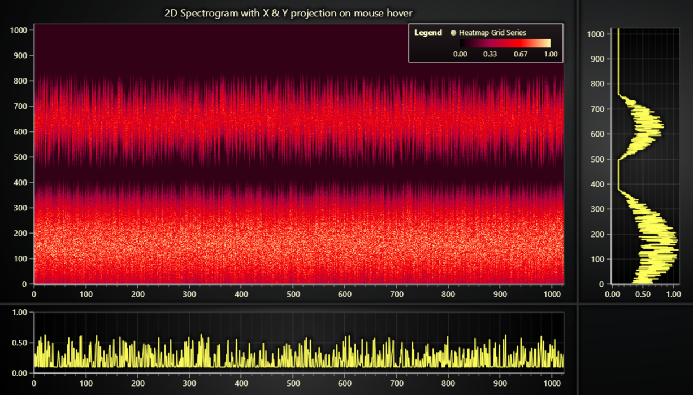

# JavaScript Spectrogram XY-Projection Chart

This demo application belongs to the set of examples for LightningChart JS, data visualization library for JavaScript.

LightningChart JS is entirely GPU accelerated and performance optimized charting library for presenting massive amounts of data. It offers an easy way of creating sophisticated and interactive charts and adding them to your website or web application.

The demo can be used as an example or a seed project. Local execution requires the following steps:

-   Make sure that relevant version of [Node.js](https://nodejs.org/en/download/) is installed
-   Open the project folder in a terminal:

          npm install              # fetches dependencies
          npm start                # builds an application and starts the development server

-   The application is available at _http://localhost:8080_ in your browser, webpack-dev-server provides hot reload functionality.

## Description

This example shows how to create a 2D spectrogram chart with X and Y line projections over last mouse coordinate (custom interaction).

Every time the user moves mouse over the spectrogram 1024 + 1024 data points are picked from the data set and pushed to X and Y projections line series - this is an expensive operation, but handled really fast with calls to `LineSeries.clear().add(data)`.

The spectrogram chart contains 1024 x 1024 = ~1 million data points.

## API Links

* [Dashboard]
* [XY cartesian chart]
* [Heatmap Grid Series Intensity]
* [Line Series]
* [Axis scroll strategies]
* [Paletted Fill]
* [LUT]
* [Empty line style]
* [Legend Box]
* [Legend Box builders]

## Support

If you notice an error in the example code, please open an issue on [GitHub][0] repository of the entire example.

Official [API documentation][1] can be found on [LightningChart][2] website.

If the docs and other materials do not solve your problem as well as implementation help is needed, ask on [StackOverflow][3] (tagged lightningchart).

If you think you found a bug in the LightningChart JavaScript library, please contact support@lightningchart.com.

Direct developer email support can be purchased through a [Support Plan][4] or by contacting sales@lightningchart.com.

[0]: https://github.com/Arction/
[1]: https://lightningchart.com/lightningchart-js-api-documentation/
[2]: https://lightningchart.com
[3]: https://stackoverflow.com/questions/tagged/lightningchart
[4]: https://lightningchart.com/support-services/

© LightningChart Ltd 2009-2022. All rights reserved.

[Dashboard]: https://lightningchart.com/js-charts/api-documentation/v4.2.0/classes/Dashboard.html
[XY cartesian chart]: https://lightningchart.com/js-charts/api-documentation/v4.2.0/classes/ChartXY.html
[Heatmap Grid Series Intensity]: https://lightningchart.com/js-charts/api-documentation/v4.2.0/classes/HeatmapGridSeriesIntensityValues.html
[Line Series]: https://lightningchart.com/js-charts/api-documentation/v4.2.0/classes/LineSeries.html
[Axis scroll strategies]: https://lightningchart.com/js-charts/api-documentation/v4.2.0/variables/AxisScrollStrategies.html
[Paletted Fill]: https://lightningchart.com/js-charts/api-documentation/v4.2.0/classes/PalettedFill.html
[LUT]: https://lightningchart.com/js-charts/api-documentation/v4.2.0/classes/LUT.html
[Empty line style]: https://lightningchart.com/js-charts/api-documentation/v4.2.0/variables/emptyLine.html
[Legend Box]: https://lightningchart.com/js-charts/api-documentation/v4.2.0/classes/Chart.html#addLegendBox
[Legend Box builders]: https://lightningchart.com/js-charts/api-documentation/v4.2.0/variables/LegendBoxBuilders.html

